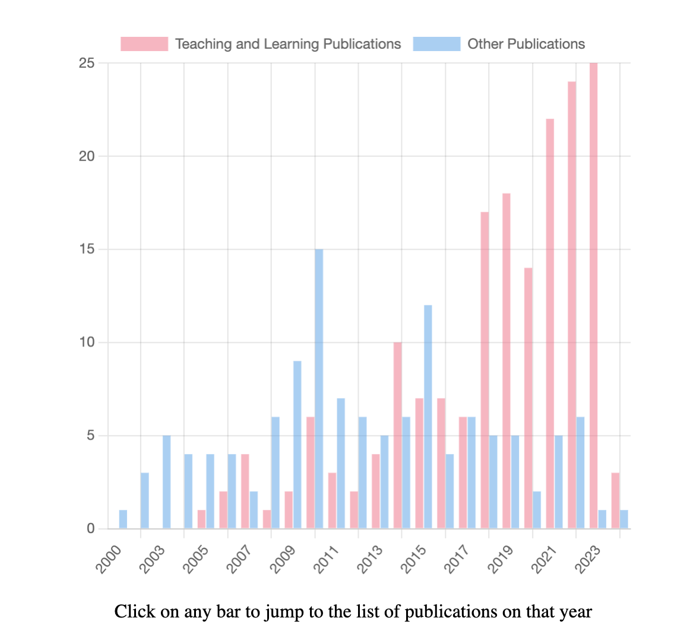

```{r setup, include=FALSE}
knitr::opts_chunk$set(echo = FALSE)

# Learn more about creating blogs with Distill at:
# https://rstudio.github.io/distill/blog.html
```

Besides the faculty research sites, should a department be listing their faculty's productivity on their site?

A department may want to highlight their identity to future employees or visitors. For example,
an academic unit with specific research agenda will benefit from showing in one place what their
faculty are currently working on.

Some departments have enough budget that they can dedicate resources (and people) to manually selecting the publications of their faculty. If you leave it up to faculty to reach out to this administrative person you will probably end up with some gaps (as some members may not communicate their publications as often as others). On the other hand, if you leave it up to the department to select what publications
must be highlighted, unless this person is an expert on the field there may be some gaps as well.

So I found a compromise between the two options. One can build a Google Scholar's profile (https://scholar.google.com/intl/en/scholar/citations.html). GoogleScholar will automatically add
new publications and the faculty member can decide what to include and what to remove. The good
news is that even if the faculty member doesn't do anything, as long as they create the profile once,
the list of publications will keep updating.

This approach can work because there is a python library called scholarly (https://pypi.org/project/scholarly/) that can query Google Scholar.

I created a python script that queries all the GoogleScholar profiles of our faculty. The python script creates a JSON file for each author and I wrote a HTML/JS "very bare bones" interface that allows the user
to navigate the large list of publications and filter them by year, person, topic...etc

But hey, there is even an interactive chartJS graph that can count how many publications related to "learning research" there are per year.

<figure class="image">
  
  <figcaption>Interactive chart on the website http://chemdata.r.umn.edu/scholar/ </figcaption>
</figure>

All the code is on github (https://github.com/xavierprat/scholarly-at-UMR?tab=readme-ov-file) and a live example of the interface is available on my site http://chemdata.r.umn.edu/scholar/ . Check the Github repository for instructions about customization and installation.

The python script needs be run everytime you want the list to be updated so you may want to setup a crontab on your server to periodically query GoogleScholar.

If you try it and have questions, just let me know!

