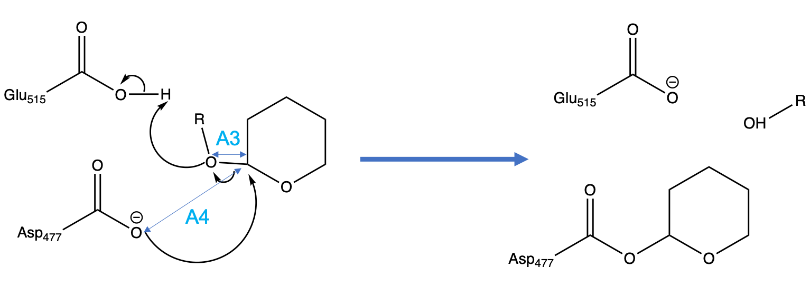

```{r setup, include=FALSE}
knitr::opts_chunk$set(echo = FALSE)
```

# Introduction

One of the daunting tasks when running molecular simulations with thousands of atoms is to
understand the results of your calculations. You have many files, long simulations, and it may be
hard to reduce all that information into the chemistry of arrow pushing mechanism that you are used to.
Granted that if you have the time you want to spend it looking at the actual structures on VMD/PyMol,
but your supervisor/collaborator doesn't have time for that and wants to see graphs, tables and evidence of what you are talking about.

Here I will try to show some basic analysis of an umbrella sampling simulation to calculate the free
energy profile along a reaction coordinate. 
Mostly the purpose of this post is to show some basic R scripting to manipulate and plot data.

# The reaction and the reaction coordinates

The reaction to study is a trans-acetalization. In terms of organic chemistry is a nucleophilic addition
and nucleophilic elimination. The goal here is to understand if that happens through a stable intermediate
and what level of synchronocity exists between the distances labeled as "A3" and "A4".

<figure class="image">
   
   <figcaption>The active site of the reaction we want to study</figcaption>
 </figure>

Our molecular dynamics simulations were based on the scanning of the asymmetric stretch coordinate (A3-A4) under
an umbrella potential.

# Load trajectory files and measure time-dependent magnitudes

Considering that we used CHARMM to run the simulations we will use CHARMM's scripting analysis tools. 
Alternative tools such as [MDAnalysis](https://www.mdanalysis.org/) are very powerful, but for the sake of pedagogy
I will use a DIY approach, even if it takes us longer. 
The following is a CHARMM script that loads the trajectory file dcd and measures the distances involved in the reaction coordinate.

```
!load the dcd trajectories
open unit 51 read name @inputdir/@window.dcd

!Open data output file
open write form UNIT 28 name @d/@window.a3.data
open write form UNIT 29 name @d/@window.a4.data
open write form UNIT 30 name @d/@window.515o2_h.data
open write form UNIT 31 name @d/@window.h_o3.data
open write form UNIT 32 name @d/@window.477o1_h.data
open write form UNIT 33 name @d/@window.515o1_h.data
open write form UNIT 34 name @d/@window.477o2_h.data

CORREL MAXSERIES 34 MAXTIMESTEPS 60000 MAXATOMS 8500

ENTER A3 DIST sele ((resid 1 .and. type O3 .and. segid S).or.(resid 3 .and. type C1 .and. segid G)) end
ENTER A4 DIST sele ((resid 477 .and. type OD1 .and. segid C).or.(resid 3 .and. type C1 .and. segid G)) end
ENTER D1 DIST sele ((resid 515 .and. type OE2 .and. segid C).or.(resid 1 .and. type HO3 .and. segid S)) end
ENTER D2 DIST sele ((resid 1 .and. type O3 .and. segid S).or.(resid 1 .and. type HO3 .and. segid S)) end
ENTER D3 DIST sele ((resid 477 .and. type OD1 .and. segid C).or.(resid 1 .and. type HO3 .and. segid S)) end
ENTER D4 DIST sele ((resid 515 .and. type OE1 .and. segid C).or.(resid 1 .and. type HO3 .and. segid S)) end
ENTER D5 DIST sele ((resid 477 .and. type OD2 .and. segid C).or.(resid 1 .and. type HO3 .and. segid S)) end

TRAJ  FIRSTU 51 NUNIT 1 begin 1 
!If your run didn't finish, you need to tell traj when to stop:
!TRAJ  FIRSTU 51 NUNIT 1 begin 1 stop 8580

write A3 unit 28 dumb time
write A4 unit 29 dumb time
write D1 unit 30 dumb time
write D2 unit 31 dumb time
write D3 unit 32 dumb time
write D4 unit 33 dumb time
write D5 unit 34 dumb time

stop
```

The code above needs to be applied to each window of simulation which will give reaction coordinate
files for each window. We will use R to load all these files and analyze them.

```{r, message= FALSE, warning=FALSE}

getFiles <- function(myPath,pattern){
  setwd(myPath)
  listOfFiles = Sys.glob("eqq*.data")
  listOfFiles = listOfFiles[grepl(pattern,listOfFiles)]
  n = listOfFiles[grepl("n",listOfFiles)]
  p = listOfFiles[grepl("p",listOfFiles)]
  listOfFiles = c(sort(n,decreasing = TRUE),p)
  return(listOfFiles)
}
buildDataFrame <- function(maxlen,myPath, removepat, filenames){
  setwd(myPath)
  thisDataFrame <- data.frame(matrix(NA,nrow = maxlen, ncol = length(filenames)))
  for (i in 1:length(filenames)){
    thisCol = read.table(filenames[i],header = FALSE)
    thisColName = gsub(removepat,"",filenames[i])
    names(thisDataFrame)[i] = thisColName
    #R must have a function, but thisCol may be shorter than maxlen, so better to do it one by one
    for (j in 1:length(thisCol$V2)){
      thisDataFrame[[thisColName]][j] = thisCol$V2[j]
    }
  }
  return(thisDataFrame)
}

myPath = "/Users/xavier/Gd/Research/Chile/Camilo/analysis_dist/"
a3_files = getFiles(myPath,"a3")
a4_files = getFiles(myPath,"a4")

#this assumes that the first window of the list has the maximum length (a finished job)
#some windows were not run to the finish so they will have NA at the end
sample = read.table(a3_files[1],header = FALSE)
maxlen = length(sample$V2)
a3 = buildDataFrame(maxlen,myPath,".a3.data",a3_files)
a4 = buildDataFrame(maxlen,myPath,".a4.data",a4_files)
a3a4 = a3-a4

fe_a3a4 = read.csv("/Users/xavier/Gd/Research/Chile/Camilo/10ns/free_energy",header = FALSE, sep = "\t")
```

# Analysis of reaction coordinate: nucleophilic elimination O - C - O

## Dynamic analysis

A brief statistical summary (using R's function summery) can give information about each window:

```{r, message= FALSE, warning=FALSE}
for (i in 1:ncol(a3a4)){
   print(paste("Showing results for the Rc=A3-A4 for window:",names(a3a4)[i],sep = ""))
   print(summary(a3a4[,i]))
}
```


In addition to the above average data and in order to get a more visual and dynamic overview 
of what the reaction coordinates look like in each of our windows 
we can plot the two distances that make up our reaction coordinate. A3 in red and A4 in blue.

```{r, message= FALSE, warning=FALSE}
#this builds a 3x3 lattice. oma and mar take care of margins
par(mfrow=c(3,3),
    oma = c(5,4,0,0) + 0.1,
    mar = c(0,0,1,1) + 0.1)


for (i in 1:length(a3_files)){
  #I'm using ohfiles just for naming and finding windows
  colname = gsub(".a3.data","",a3_files[i])
  #only show y-axis numbers on the first graph of the row
  #print(colname)
  if ( (i+2)%%3 == 0){
    plot( a3[[colname]],ylim=c(0.5,3.5),type="l",col="red" ,ann = FALSE,xaxt='n')
    lines(a4[[colname]],ylim=c(0.5,3.5),type="l",col="blue",ann = FALSE,xaxt='n')
  }else{
    plot( a3[[colname]],ylim=c(0.5,3.5),type="l",col="red" ,ann = FALSE,xaxt='n',yaxt='n')
    lines(a4[[colname]],ylim=c(0.5,3.5),type="l",col="blue",ann = FALSE,xaxt='n')
  }
  rcValue = gsub("eqq_","",colname)
  graphTitle = paste(rcValue,"Avg:A3=",round(mean(a3[[colname]], na.rm = TRUE),digits = 2),
                                " A4=",round(mean(a4[[colname]], na.rm = TRUE),digits = 2),sep = "")
  title(graphTitle,line=-7)
}

```
The chemistry question is wether the nucleophilic attack (A4: blue) happens at the same time as the elimination (A3: red) or not.
The elimination (A3) only starts happening once the attacking nucleophile (A4 blue) is close enough at window n04.
It is also true that while there is a tetra-coordinate intermediate at window p00, the distances do not belong
to a regular O-C distance (1.5) and they are rather long around 2.0. This fact allows to predict without looking
a the free energy that it cannot possibly be a stable intermediate.
Therefore the nucleophilic/elimination reaction happens rather synchronously and in one step.

## Umbrella Sampling

When plotting a histogram one can build a histogram of all windows at the same time:

```{r, message= FALSE, warning=FALSE}
dens = hist(data.matrix(a3a4),breaks = 300,plot = FALSE)
plot(dens$mids,dens$density,type="l",main="A3-A4")
```


Notice that the above histograms does not distinguish between windows. In order to see the overlap
between windows we will build a histogram for each window.

```{r, message= FALSE, warning=FALSE}
plot(0,0,xlim = c(-2,1.70),ylim = c(0,200),type = "n")
cl = rainbow(ncol(a3a4))
## here you set the font size 
op <- par(cex = 0.5)
for (i in 1:ncol(a3a4)){
  dens = hist(a3a4[,i],breaks = 25,plot = FALSE)
  lines(dens$mids,dens$counts,col=cl[i],type='l')
}
legend("topleft",legend = names(a3a4),text.col = cl)
```

This representation allows us to see that there's a gap in some values at R=0.6.
This is bad because each window must significantly overlap with the neighboring windows.
The reason is the integration constants: $$ \Delta G = -RT ln(\rho) + Constant$$ 
In the straight umbrella sampling (not WHAM) we make it so that the G of the two neighboring windows
are the same at the overlapping point. If there's no overlapping the free energy is not a continuous function.
We are going to continue with the analysis but in a real context we would have to run more windows
to cover those gaps shown in the histograms above.

We can still plot the free energy along this coordinate using the WHAM method.
We will use [Alan Grossfield's WHAM code](http://membrane.urmc.rochester.edu/?page_id=126). 

```{r, message= FALSE, warning=FALSE}

plot(fe_a3a4$V1,fe_a3a4$V2)

```


# Analysis of additional reaction coordinates: proton transfers

The fact that we were able to obtain an apparently continous free energy profile does not necessarily mean that
the chosen reaction coordinate (A3-A4) is the right one. We know that proton transfers play a significant role
and it could well be that while are scanning A3-A4 the protons are switching back and forth to accommodate
the scanning rather than following the true reaction path.

## Dynamic analysis

We know that there's a proton than can jump from three different sites: Asp477, Glu515, and O3 (the substrate leaving group)

Let's start by loading up the files and calculate basic statistical for each window.

```{r, message= FALSE, warning=FALSE}
#Get file names
o1_477h_files = getFiles(myPath,"477o1_h")
o2_477h_files = getFiles(myPath,"477o2_h")
o1_515h_files = getFiles(myPath,"515o1_h")
o2_515h_files = getFiles(myPath,"515o2_h")
o3h_files = getFiles(myPath,"h_o3")

o1_477h = buildDataFrame(maxlen,myPath,".477o1_h.data",o1_477h_files)
o2_477h = buildDataFrame(maxlen,myPath,".477o2_h.data",o2_477h_files)
o1_515h = buildDataFrame(maxlen,myPath,".515o1_h.data",o1_515h_files)
o2_515h = buildDataFrame(maxlen,myPath,".515o2_h.data",o2_515h_files)
h_o3 =    buildDataFrame(maxlen,myPath,".h_o3.data",o3h_files)
```

A carboxylic acid has two potential oxygens that can hold a proton. We must first make sure
that we are monitoring the right O-H distance. In other words, identify the oxygen that is holding or interacting with the proton.

For that we can have a quick look at averages and minimum distances during each trajectory.

```{r, message= FALSE, warning=FALSE}
for (i in 1:length(o1_477h_files)){
  colname = gsub(".477o1_h.data","",o1_477h_files[i])
  myLine = paste(colname,"AspO1-H Ave",sprintf('%.2f',mean(o1_477h[[colname]],na.rm = TRUE)),
                                 "Min",sprintf('%.2f',min(o1_477h[[colname]],na.rm = TRUE)),
                         "AspO2-H Ave",sprintf('%.2f',mean(o2_477h[[colname]],na.rm = TRUE)),
                                 "Min",sprintf('%.2f',min(o2_477h[[colname]],na.rm = TRUE)),
                 sep = " : ")
  print(myLine)
}
```

So we can conclude that Asp477 has "O1" as the active oxygen because the O2-H distance is always longer and
therfore irrelevant.

```{r, message= FALSE, warning=FALSE}
for (i in 1:length(o1_515h_files)){
  colname = gsub(".515o1_h.data","",o1_515h_files[i])
  myLine = paste(colname,"GluO1-H Ave",sprintf('%.2f',mean(o1_515h[[colname]],na.rm = TRUE)),
                                 "Min",sprintf('%.2f',min(o1_515h[[colname]],na.rm = TRUE)),
                         "GluO2-H Ave",sprintf('%.2f',mean(o2_515h[[colname]],na.rm = TRUE)),
                                 "Min",sprintf('%.2f',min(o2_515h[[colname]],na.rm = TRUE)),
                 sep = " : ")
  print(myLine)
}

```

From the above we see that both oxygens of Glu515 are active at a different times of the reaction.

Finally we can look at when the proton makes it to its final destination, the leaving group O3.

```{r, message= FALSE, warning=FALSE}
for (i in 1:length(o3h_files)){
  colname = gsub(".h_o3.data","",o3h_files[i])
  myLine = paste(colname,"O3-H Ave",sprintf('%.2f',mean(h_o3[[colname]],na.rm = TRUE)),
                                 "Min",sprintf('%.2f',min(h_o3[[colname]],na.rm = TRUE)),
                 sep = " : ")
  print(myLine)
}
```

We can see that it arrives as soon as the window Rc=-0.4 and it stays there for the rest of the reaction.

So it looks like in terms of proton transfer lots of things are happening among the four oxygens being mentioned.

Except for Asp477O2-H distance identified as not relevant, 
the other four will be taken into account in the below representation:
The Asp477-O1 (red), the two Glu515-O (1:blue and 2:green) and the leaving group O3(black).

```{r, message= FALSE, warning=FALSE}
#this builds a 3x3 lattice. oma and mar take care of margins
par(mfrow=c(2,3),
    oma = c(5,4,0,0) + 0.1,
    mar = c(0,0,1,1) + 0.1)

for (i in 1:length(h_o3)){
  #I'm using ohfiles just for naming and finding windows
  colname = gsub(".h_o3.data","",o3h_files[i])
  #only show y-axis numbers on the first graph of the row
  #print(colname)
  if ( (i+2)%%3 == 0){
    plot(o1_477h[[colname]],ylim=c(0.5,4.5),type="l",col="red",ann = FALSE,xaxt='n')
    lines(o1_515h[[colname]],ylim=c(0.5,4.5),type="l",col="blue",ann = FALSE,xaxt='n')
    lines(o2_515h[[colname]],ylim=c(0.5,4.5),type="l",col="green",ann = FALSE,xaxt='n')
    lines(h_o3[[colname]],ylim=c(0.5,4.5),type="l",col="black",ann = FALSE,xaxt='n')
  }else{
    plot(o1_477h[[colname]],ylim=c(0.5,4.5),type="l",col="red",ann = FALSE,xaxt='n',yaxt='n')
    lines(o1_515h[[colname]],ylim=c(0.5,4.5),type="l",col="blue",ann = FALSE,xaxt='n',yaxt='n')
    lines(o2_515h[[colname]],ylim=c(0.5,4.5),type="l",col="green",ann = FALSE,xaxt='n',yaxt='n')
    lines(h_o3[[colname]],ylim=c(0.5,4.5),type="l",col="black",ann = FALSE,xaxt='n',yaxt='n')
  }
  rcValue = gsub("eqq_","",colname)
  graphTitle = rcValue
                            
  title(graphTitle)
}

```
Let's read carefully the above representations, from products p15 to reactants n17

* **p15:** Hydrogen is already in O3 and Glu515-O1 is hydrogen bonded to it

* **p01 to p13:** The roles of the two Glu515 oxygens to be hydrogen bonded to the H-O3 is switched.The window p02
is specially remarkable as it switches twice. This is not ideal. You want to see 

* **n05 to p00:** This is the transition state area. There seems to be only Glu515-O2 participating with the transfer.

*  **n07:** This window is particularly problematic because it shows a different H-bonding pattern at the beginning and
at the end. 
This window starts with the bonding similar to n05 but it ends with the bonding of n09.

* **n09 to n11:** Asp477 is holding the proton during these two windows and it releases it back to Glu515O2 in n13,n15, and n17.
This step doesn't make much chemical sense because Asp477 is supposed to be the nucleophile by accepting a proton
its nucleophilic character is diminished.

# Conclusion

It is true that we were able to obtain a smooth free energy profile that took us from reactants to products.
But at this point the work is not done. Some of the proton transfers in the negative side of the reaction coordinate,
specially n11 to n07 will require longer simulations and discard any non-equilibrium arrangements.
The goal here is to make sure that we can justify each proton transfer as a genuine and chemically justifiable
rather than an artifact of scanning an incomplete reaction coordinate pulled across different energy valleys.

