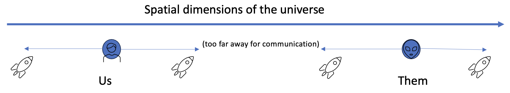
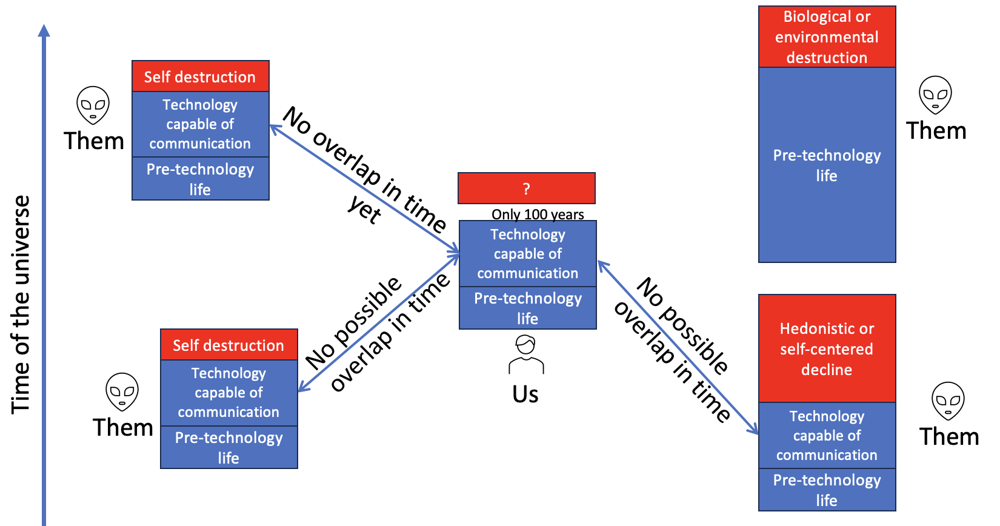
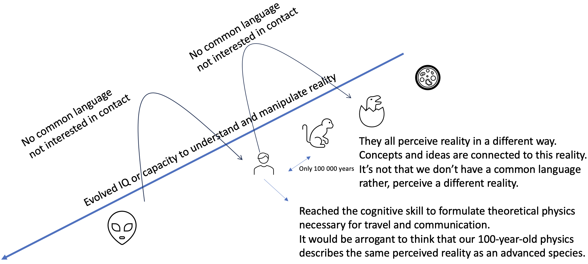
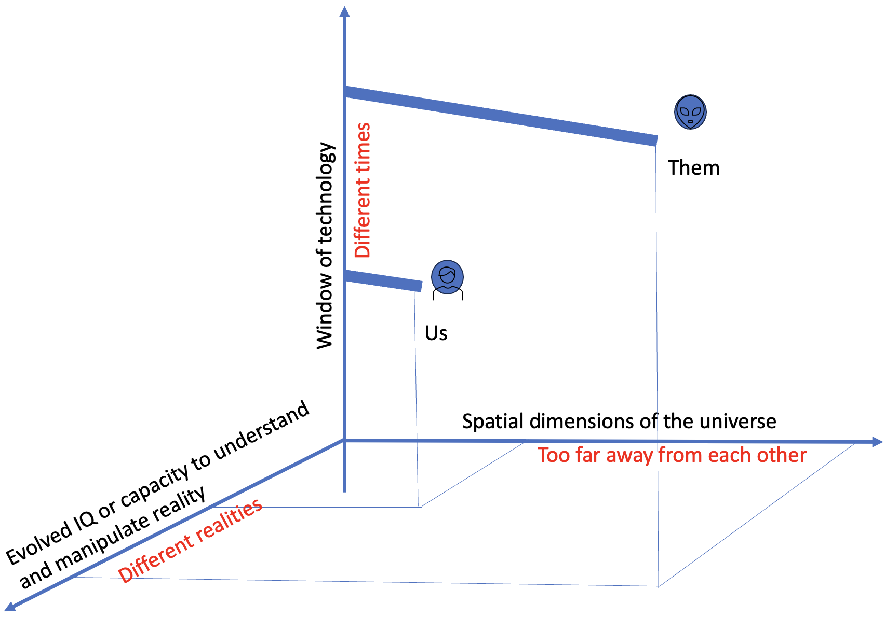

```{r setup, include=FALSE}
knitr::opts_chunk$set(echo = FALSE)
```

# Introduction: The Fermi paradox is not a paradox

ChatGPT says that "The Fermi Paradox is the apparent contradiction between the high probability of extraterrestrial civilizations existing in the universe and the lack of evidence or contact with such civilizations."

Enrico Fermi was known for many things, among them he was known to guesstimate a number, a back of the envelope
calculation to know the ballpark or magnitude of a quantity. I don't agree with the Fermi paradox, mostly because we only know of one single planet with life and we don't have any serious theory that explains
the formation of life (abiogenesis), so we are trying to do statistics with a sample of n=1.
Here I want to lay out also that even if the formation of life is guaranteed (given a set of 
conditions of composition and temperature of a planet), there are robust statistical estimations
that explain why we haven't seen anyone yet.


# The vast distance

The dimensions of the universe are too large and information (light or matter) travels way too slow. 
So the first explanation is that we have not seen anyone yet because we are too far away and cannot hear each other.

Some numbers to show such vastness:

- Closest star: proxima centauri 4.2 light years
- Via lactea: 105,700 light years wide
- Closest galaxy: 25,000 light years
- 2nd closest galaxy: 75,000 light years


<figure class="image">
  
  <figcaption>Distance</figcaption>
</figure>

So this is the first barrier for contact, unless we find a
[wormhole](https://en.wikipedia.org/wiki/Wormhole) in spacetime or a parallel universe, 
the very vastness of space and the time that it takes to travel becomes too large. 

# Time: The time window of civilization seems unlikely and short

<figure class="image">
  
  <figcaption>Window of civilization</figcaption>
</figure>

Any form of life capable of civilization may go through 3 stages:

1. Pre-technology period
2. Technology period
3. Decline or self-destruction

Two civilizations will hear from each other only during the technology period.
Now we are getting outside of physics and more perhaps into History or Anthropology. In other words,
we have too look into how civilizations are created, evolve, perhaps reach a technological state, and eventually fade.

The hypothesis here is that any living society, as it progresses, 
it will reach a third stage when technology becomes so powerful or the expo that it evolves or plateaus to something else.

My guess is that such change or plateau can happen in 4 different ways.

1. It never achieves the technology for space exploration and communication and remains in a pre-technology stage. This seems to me very likely. I don't see in Darwinian biology any evidence
that humans had to have such supremacy and allowed to reach a technology state. The fact that after
4.5E9 years of life on earth only the last 2E4 have had human technology seems a rare event. It took too 
long to be necessary or spontaneous,
so my vote is that this option is the most frequent.

2. An external factor ends its civilization: An astronomical (meteor), biological (pandemic) or environmental (drought, flood...) just prevents them to continue or severely halts its progress

3. Self-destruction: the very genes making us a superior species are a threat to ourselves.
The survival and selfish genes which made us survive and thrive are now threatening our self-destruction. 
A note on self-destruction: A quote attributed to Albert Einstein says "I know not with what weapons World War III will be fought, but World War IV will be fought with sticks and stones."
 One should expect technology to evolve faster than evolution, so our rudimentary genes are not
altruistic enough to deal with nuclear bombs and a worldwide common good. This is why humans are a threat to
themselves.  The only possible escape from destruction is if our primitive genes are Replaced by AI. 

4. Hedonic decline: We have to remember that our intrinsic need to explore space comes from our genes that
makes us improve our lives in an environment of scarcity.
Will we still have the need to explore space when all our needs are satisfied? 
If technology provides all the primitive genetic needs maybe a civilization will stop exploring and will settle.
Will we be connected to VR worlds with VR
experiences and injected drugs to make us feel all what we desire
while our bodies linger? This is the decline of the Roman Empire but without a barbaric invasion.
There's a scene in the Wall-e movie that shows what I mean (https://www.google.com/search?q=wall-e+scene+with+sedentary+people)

In conclusion, we should accept that there may be a window of technology (rather than a lasting stage of technology).
The universe is 15 billions years old (15E9), there’s been life on earth for 4 billions (4E9). The formation of life may not be rare, but the window of technology may be rare and short considering that it’s been only 150 years since we’ve had radio technology and 50 since space travel and we’re already talking about potential civilization collapse. 


# Intellect: the intellectual distance between species

<figure class="image">
  
  <figcaption>Intellectual distance</figcaption>
</figure>

And now we are in the philosophical realm. Different species do not perceieve reality the same
way.
This goes in the direction of 

1. There are things we know
2. There are things we know we don't know
3. There are things we don't know we don't know

Being this third category by definition the largest one.

There may be advanced species who perceive reality in a way we cannot comprehend.
The same way that a dog cannot comprehend the patterns of the planets, maybe we cannot comprehend other patterns.
The scary part is that they may already have contacted/influenced us without us realizing.
Do bees realize that we use them for honey? Do they know we exist? Is a bee capable of "knowing"?

Even if they have not contacted us, expecting this alien species to be in our intellectual
vicinity is quite pretentious. I do not know what species on earth we are cognitively closest, chimpanzees perhaps? And yet, chimpanzees cannot comprehend the very idea of our technology.
So, if our intellectually closest species, with whom we share most of our genetics and biochemistry,
they cannot see "eye to eye" with us, how naive is that we can see eye to eye with a civilization
that has evolved independently from us?

A counterargument to this "intellectual distance" argument is that may be that IQ plateaus. 
As soon as a species can develop language and social structures, it will protect the weak and
cognitive evolution stops.
The other option to this "IQ plateau" hypothesis is an AI-motivated IQ inflation. That is,
if they developed some AI that surpasses the biological IQ and it keeps improving at a pace
much quicker than what evolution would go.


# All together

Finally if we put all these distances together, 
it does not seem to me that it is a paradox that we have not seen (or recognized) any alien life.

<figure class="image">
  
  <figcaption>Fermi's paradox is not a paradox. Even if we assume that life is frequent in the universe there are 3 groups of reasons why we have not heard from each other.</figcaption>
</figure>

