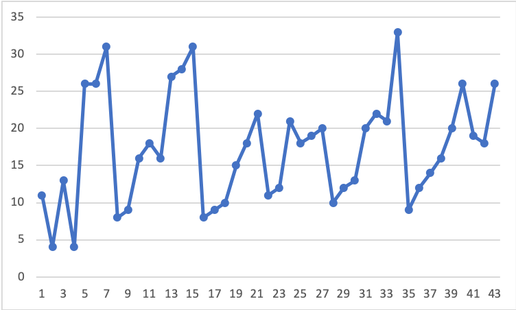

```{r setup, include=FALSE}
knitr::opts_chunk$set(echo = FALSE)

```

```{r , echo=FALSE, message= TRUE, warning=FALSE}
#this script looks at how students prepared for the milestones
# library(psych)
# library(knitr)
# library(chron)
# setwd("~/Gd/Teaching/Chemistry_Curriculum/CHEM4/S20/Analysis")
# #name, id, submitted, attempt, score, n.correct, n.incorrect
# m1_practice=read.csv("m1_practice.csv", header = TRUE)
# m1_practice = subset(m1_practice, select = 
#                        c("name","id","submitted","attempt", "score", "n.correct", "n.incorrect"))
# #Formatting dates and calcualting difference in dates
# m1date = as.POSIXct("2020-02-12 17:15:00 UTC", format = "%Y-%m-%d %H:%M:%S")
# m1_practice$submitted<- as.POSIXct(m1_practice$submitted, format = "%Y-%m-%d %H:%M:%S")
# #the difference is a number in minutes
# m1_practice$timeDiff = m1date - m1_practice$submitted 
# 
# m2_practice=read.csv("m2_practice.csv", header = TRUE)
# m2_practice = subset(m2_practice, select = 
#                        c("name","id","submitted","attempt", "score", "n.correct", "n.incorrect"))
# #Formatting dates and calcualting difference in dates
# m2date = as.POSIXct("2020-02-28 17:15:00 UTC", format = "%Y-%m-%d %H:%M:%S")
# m2_practice$submitted<- as.POSIXct(m2_practice$submitted, format = "%Y-%m-%d %H:%M:%S")
# #the difference is a number in minutes
# m2_practice$timeDiff = m2date - m2_practice$submitted 
# 
# 
# m1_quiz=read.csv("m1_quiz.csv", header = TRUE)
# m1_quiz = subset(m1_quiz, select = c("name","id","submitted","attempt", "score", "n.correct", "n.incorrect"))
# m1_quiz$submitted<- as.POSIXct(m1_quiz$submitted, format = "%Y-%m-%d %H:%M:%S")
# 
# m2_quiz=read.csv("m2_quiz.csv", header = TRUE)
# m2_quiz = subset(m2_quiz, select = c("name","id","submitted","attempt", "score", "n.correct", "n.incorrect"))
# ## Video data
# videos = read.csv("~/GenChem2/S20/Analysis/Videos/results.csv", header = TRUE)
# 
# #Participation
# #Previous grades
# chem123 = read.csv("~/Teaching/Grades_and_SRT/chem123_f18f19.csv")
# 
# 
# #lets take the highest score in your practice and compare it with your score in milestones
# stud1 = unique(m1_quiz$name)
# 
# compileM1 = data.frame(matrix(ncol = 11, nrow = 0))
# colnames(compileM1) = c("name","id","highestScorePract","numbAttempt","quizScore","timeDiff","TotalWatched","TotalMissed","chem1","chem2","chem3")
# for (st in stud1){
#   thisSt = m1_practice[which(m1_practice$name == st),]
#   hiSc = max(thisSt$score,na.rm = TRUE)
#   nAtt = max(thisSt$attempt, na.rm = TRUE)
#   timeDiff = max(thisSt$timeDiff, na.rm = TRUE)
#   quizScore = m1_quiz[which(m1_quiz$name == st),]$score
#   id = m1_quiz[which(m1_quiz$name == st),]$id
#   
#   c1 = chem123[which(chem123$X == id),]$Final.1
#   c2 = chem123[which(chem123$X == id),]$Final.2
#   c3 = chem123[which(chem123$X == id),]$Final.3
#   if(length(c1)==0) {c1=NA}
#   if(length(c2)==0) {c2=NA}
#   if(length(c3)==0) {c3=NA}
#   
#   TotalWatched = videos[which(videos$X == st),]$TotalWatched
#   #convert into minutes watched
#   TotalWatched = as.numeric(times(TotalWatched))*60*24
#   TotalMissed  = videos[which(videos$X == st),]$TotalMissed
#   
#   compileM1[nrow(compileM1) + 1,] = c(st,id,hiSc,nAtt,quizScore,timeDiff,TotalWatched,TotalMissed,c1,c2,c3)
# }
# compileM1$highestScorePract = as.numeric(as.character(compileM1$highestScorePract))
# compileM1$highestScorePract = compileM1$highestScorePract/12*100
# compileM1$numbAttempt = as.numeric(as.character(compileM1$numbAttempt))
# compileM1$quizScore = as.numeric(as.character(compileM1$quizScore))
# 
# stud2 = unique(m2_quiz$name)
# compileM2 = data.frame(matrix(ncol = 11, nrow = 0))
# colnames(compileM2) = c("name","id","highestScorePract","numbAttempt","quizScore","timeDiff","TotalWatched","TotalMissed","chem1","chem2","chem3")
# 
# for (st in stud2){
#   thisSt = m2_practice[which(m2_practice$name == st),]
#   hiSc = max(thisSt$score,na.rm = TRUE)
#   nAtt = max(thisSt$attempt, na.rm = TRUE)
#   timeDiff = max(thisSt$timeDiff, na.rm = TRUE)
#   quizScore = m2_quiz[which(m2_quiz$name == st),]$score
#   id = m2_quiz[which(m2_quiz$name == st),]$id
#   
#   c1 = chem123[which(chem123$X == id),]$Final.1
#   c2 = chem123[which(chem123$X == id),]$Final.2
#   c3 = chem123[which(chem123$X == id),]$Final.3
#   if(length(c1)==0) {c1=NA}
#   if(length(c2)==0) {c2=NA}
#   if(length(c3)==0) {c3=NA}
#   
#   TotalWatched = videos[which(videos$X == st),]$TotalWatched
#   #convert into minutes watched
#   TotalWatched = as.numeric(times(TotalWatched))*60*24
#   TotalMissed  = videos[which(videos$X == st),]$TotalMissed
#   
#   compileM2[nrow(compileM2) + 1,] = c(st,id,hiSc,nAtt,quizScore,timeDiff,TotalWatched,TotalMissed,c1,c2,c3)
# }
# compileM2$highestScorePract = as.numeric(as.character(compileM2$highestScorePract))
# compileM2$highestScorePract = compileM2$highestScorePract/12*100
# compileM2$numbAttempt = as.numeric(as.character(compileM2$numbAttempt))
# compileM2$quizScore = as.numeric(as.character(compileM2$quizScore))

setwd("~/Gd/Teaching/Chemistry_Curriculum/CHEM4/S20/Analysis")
compileM1 = read.csv("compileM1.csv",header = TRUE)
compileM2 = read.csv("compileM2.csv",header = TRUE)

```


# Preamble

It is recognized among educational scholars that quick and clear feedback to students on their performance
improves their self awareness and ultimately their performance.

It is also true that if the instructor does not provide context to a grade or performance
the students will fill up that context, and that one is usually not accurate and detrimental for their learning.

A clear and efficient way to provide context to students is by plotting data readily available on your course management
system. In this post I share what I compile and show my students mid-semester when there is still time for them
to change their course outcome. Data such as how much and how often they watch the course videos, 
how many times they attempt their practice and graded quizzes (here called milestones), 
and how their behavior compares with other students and previous years. 
Here below is what I shared with them.

# What was sent to students

We are more than one month into the semester and it is now a good time to look into what students
can do to improve their grade, or at least, understand the main factors that affect
student performance. The conclusions here are based on general trends and averages. 
Individually, however, each student may be in a specific situation and not all conclusions may apply to them.

We are going to look at Milestone performance because we already had gone through two 
milestones. Also, considering that students are given the questions ahead of time, a low
performance in milestone means that there is something that is not working.

The milestone grades are fairly low as we can see in the following histograms

```{r , echo=FALSE, message= TRUE, warning=FALSE}
hist(compileM1$quizScore,breaks=14, main = "Milestone 1. Grade", xlab = "Score", ylab = "Number of students")
hist(compileM2$quizScore,breaks=14, main = "Milestone 2. Grade", xlab = "Score", ylab = "Number of students")
```


# Preparing for Milestones

Canvas records how many times and what score you obtained each time you attempt the practice milestone quiz as well as how early you attempted.

## Score in the milestone practice

Here below we are correlating the score in the practice quiz and the score in the actual milestone quiz. The first plot is Milestone 1

```{r , echo=FALSE, message= TRUE, warning=FALSE}
plot(compileM1$highestScorePract,compileM1$quizScore,xlim = c(0,100),ylim = c(0,100),main = "Milestone 1. Practicing score",xlab = "Highest score in practice quiz",ylab = "Score in Milestone 1")
lines(x = c(0,100), y = c(0,100))

```

And here below is the same with Milestone 2.

```{r , echo=FALSE, message= TRUE, warning=FALSE}
plot(compileM2$highestScorePract,compileM2$quizScore,xlim = c(0,100),ylim = c(0,100),main = "Milestone 2. Practicing score",xlab = "Highest score in practice quiz",ylab = "Score in Milestone 2")
lines(x = c(0,100), y = c(0,100))
```

**Conclusion** The high correlation between score in practice and score in the actual quiz indicates that if you are struggling to get a good score in the milestone, you need to make sure that you score high enough while preparing for it.

## Number of attempts.

```{r , echo=FALSE, message= TRUE, warning=FALSE}
plot(compileM1$numbAttempt,compileM1$quizScore,ylim = c(0,100),main = "Milestone 1. #Attempts",
     xlab = "Number of attempts in practice quiz",ylab = "Score in Milestone 1")

```

```{r , echo=FALSE, message= TRUE, warning=FALSE}
plot(compileM2$numbAttempt,compileM2$quizScore,ylim = c(0,100),main = "Milestone 2. #Attempts",
     xlab = "Number of attempts in practice quiz",ylab = "Score in Milestone 2")
abline(a=20,b=6.15)
```

**Conclusion** Number of attempts DOES NOT correlate with performance. However, one must attempt several times to obtain a good score, attempting one or two times won't work. The rest, it is up to you.

## How early should you start practicing?

If we plot how early you started practicing, we can see that there is no realy any correlation 
in Milestone 1. The x-axis tells you the time you started your first practice quiz, in minutes,
which is an indication of how early you started studying.

```{r , echo=FALSE, message= TRUE, warning=FALSE}
plot(compileM1$timeDiff,compileM1$quizScore,ylim = c(0,100),main = "Milestone 1. Early practice",
     xlab = "Minutes before quiz time you started practicing",ylab = "Score in Milestone 1")
```


```{r , echo=FALSE, message= TRUE, warning=FALSE}
plot(compileM2$timeDiff,compileM2$quizScore,ylim = c(0,100),main = "Milestone 2. Early practice",
     xlab = "Minutes before quiz time you started practicing",ylab = "Score in Milestone 2")
```

**Conclusion** There is no correlation. Starting early does not necessarily imply doing better in the milestone exams.

## Do you need to watch the videos?

Canvas also records if students watch a video or not. As you can see, watching all the videos
(having missed zero, x = 0) guarantees a minimum of 70% in milestone 1.

```{r , echo=FALSE, message= TRUE, warning=FALSE}
plot(compileM1$TotalMissed,compileM1$quizScore,ylim = c(0,100),main = "Milestone 1. Missed videos",
     xlab = "Number of videos NOT watched",ylab = "Score in Milestone 1")
lines(x = c(40,0), y = c(0,100))
```
```{r , echo=FALSE, message= TRUE, warning=FALSE}
plot(compileM2$TotalMissed,compileM2$quizScore,ylim = c(0,100),main = "Milestone 2. Missed videos",
     xlab = "Number of videos NOT watched",ylab = "Score in Milestone 2")
lines(x = c(40,0), y = c(0,100))
```

**Conclusion** While there are outliers, the general trend is that the fewer videos you miss the better your score is.

## How many minutes of video watching do you need?

Sometimes students will start watch the video, but they end up only watching a fraction of it.
Let us check if you should watch the whole thing or even rewatch the videos.

```{r , echo=FALSE, message= TRUE, warning=FALSE}
plot(compileM1$TotalWatched,compileM1$quizScore,ylim = c(0,100),main = "Milestone 1. Minutes of videos watched",
     xlab = "Total number of minutes of videos watched",ylab = "Score in Milestone 1")
abline(a=0,b=0.25)
```

```{r , echo=FALSE, message= TRUE, warning=FALSE}
plot(compileM2$TotalWatched,compileM2$quizScore,ylim = c(0,100),main = "Milestone 2. Minutes of videos watched",
     xlab = "Total number of minutes of videos watched",ylab = "Score in Milestone 2")
abline(a=0,b=0.25)
```

**Conclusion** If students watch more videos and more minutes of it, they will do better in exams.

# As a class, are the students watching the videos?

If we plot the number of students who skipped videos, we can see there are days that about one third of the class did not watch the videos.



