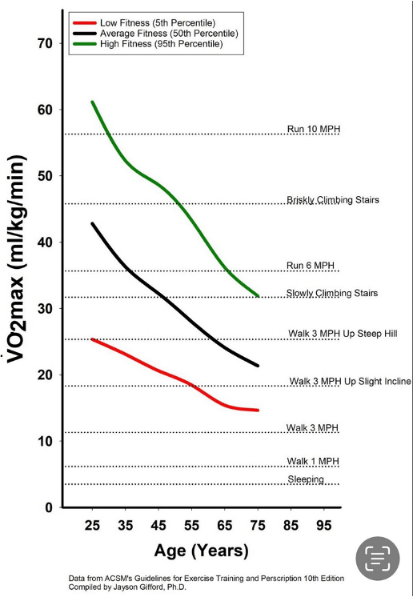
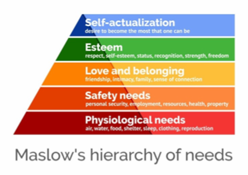

```{r setup, include=FALSE}
knitr::opts_chunk$set(echo = FALSE)
```

# 1. Introduction: the cactus in the rainforest

This is not an academic post, I don’t speak from a scholar point of view, but rather from someone who is a teacher, mentor, and father to a new generation that is exposed to new challenges. The new challenge is the dealing with the very abundance we are surrounded in the first world. There is really not a cultural framework that we all agree and can rely upon to navigate this inflation of information, choices, and temptations.
While this can be easily rejected as silly first world problems, I have witnessed in myself and others how the current abundance of distractions and pleasure is self-destructing. The big question is one of the oldest, what is the life that is worth living in the current times?

Trying to answer such question is very pretentious. This question has been tackled by many great minds before and I am not going to pretend to answer it in a systematic and thorough manner. This is not even a practical handbook, rather, it is a collection of personal impressions that by experience or reading others I have been accumulating.
I have been trying to articulate some attitudes and habits that helped me and perhaps I have already adopted, because they feel true and I want to make them last and solidify them in my routine. But also it is when I articulate it that I understand and therefore I can share it and perhaps help other people.

I will start with a fairly graphical metaphor. We are a cactus in the rainforest

<figure class="image">
  
  <figcaption>Generated by Dall-E with the prompt "Draw an overfed cactus in the rainforest"</figcaption>
</figure>

Our bodies and minds are misplaced from the conditions they evolved from. We are a cactus in the rainforest. An overfed cactus. We evolved in the scarcity of food, sex, comfort, material goods… but now the abundance and easy access to all these things is making us addicted to pleasure, and this excess of comfort is making us miserable. The goal therefore is to sharpen ourselves and avoid blindly following our pleasure instincts.

# 2. The goal: keep yourself sharp

I’ll say it from the start and I will justify it later. In order to live a fulfilling and meaningful life, we must keep ourselves sharp, in constant improvement. The premise is that by exposing ourselves to constant challenges we will get used to it, I will refer to this getting used to this discomfort as “feeling in the zone”. This approach will also allow us to take responsibility, own our lives, and not leave it up to external variables. 
We are seeking growth, not just pleasure. Pleasure is necessary and I will explain where it fits. But I am associating growth with fulfillment and meaning. One could spend too much time on definitions and not move the needle. Hopefully it will make sense later.

We exist in three different areas and those different areas need to be kept sharp

- the body: keeping yourself physically fit

- the mind: keep learning and creating new things

- the spirit or you in relationship with others (religious and philosophical overtones here, change the language if it throws you off): keep giving to others, give them your compassion, your time, even if they don’t deserve it, especially when they don’t deserve it.


This constant improvement is made of a cycle of pain and rest that I will talk about, but it is important to understand that one must get used to discomfort and constant challenge in these three areas. The goal is to build a habit of discomfort.
We can use science to justify and say that there’s enough scientific evidence about what the goal is for these three areas: physically fit, mentally sharp, socially connected. These are not objectives in themselves, the process, the barrier is the way, buiding a growth mindset will give us meaning and purpose.

In all cases notice that I’m inviting you to forget about yourself, your selfish attachments, and your limbic needs and whatever your body, mind, and soul are craving. This will be painful, it requires being vulnerable, constantly exposed to your weaknesses, but you’ll get used to it. Because we evolved in scarcity, evolution is making us lazy and selfish and we self-destruct. Back then, the very scarcity kept us sharp. Not anymore, in our times of abundance we must self-infringe scarcity to keep us sharp. By exposing ourselves to struggle we improve.

## 2.1 Goal 1: Physically fit

Let’s start with perhaps the least important. Albeit if your motivation is longevity or healthspan, then this would be the most important one. Keeping yourself physically fit is fundamental, but when in conflict with the other two areas of the self, this one should take lowest priority. Physically fit has nothing to do with your looks, not even your BMI. Again, I’m not talking about where you are today, but what direction you’re heading.
Peter Attia talks about the four main areas that one must be working on. Aerobic health, Anaerobic, Strength, and Balance.

To be very specific, one can run a quick check on the specifics. For aerobic health you need low heart rate, you should be able to hike or even slow run for long periods of time. For anaerobic the VO2max describes your maximum capacity.

Notice that I’m not talking about diet and sleep. We are just listing the challenges, the grind, the discomfort. These are the goals. Attia’s book goes into great detail. To me the most compelling argument is not necessarily the lifespan but rather threefold
How you feel after a workout and how that affects sleep, your hunger, your motivation, and even your mental abilities.
It is a great venue to transfer resilience and growth mindset. Getting used to discomfort here is a good starting point even though as I said it may not be the most important goal.
The more physically capable you are, specifically as you get old, the better you will be able to achieve other goals. The quality of life at the end of our lives is severely limited by our health.

We are not going to spend a lot of time so that we don’t lose our focus on our ultimate goal, remember, it is not necessarily our health span, it is living a life that is worth living. However, one should look at their physical fitness the same way one looks at their savings for retirement. The same way that we have financial advisors, Attia suggests that our physicians should also have a plan for retirement.
Notice in this graph that if at 45 you cannot do certain things, by 75 you will be incapable of engaging in the cycle of challenge that I’m describing below

<figure class="image">
  
  <figcaption>Like a retirement account, the savings of today are the benefits of tomorrow</figcaption>
</figure>

## 2.2 Goal 2: mentally sharp

Problem solving keeps us mentally sharp.
I’m using the term mentally sharp as a very wide net of human activities. For example, playing an instrument, singing or dancing, they all require a mental skill that must be learned, learned through discomfort and pain. 
One can start with daily low-level activities such as writing in a diary, reading a classic, doing the daily sudoku or calculating your own taxes. But to move the needle one may need a big project.
Some “big-project” examples can be
Write a book
Learn a language or a new technology
Engage in uncomfortable conversations
Create art, express yourself

Why big projects? Big projects help us with changing our routines. The same way that for keeping physically fit it is not enough to decide to take the stairs, because a tiny change may improve our health, but remember we are trying to improve our growth mindset, so a harder challenge will help us do that. In that sense,  one can decide to run a marathon or do 100 push ups a day as a way to break bad habits. 
Engage in problem solving: both in complicated problems and in complex problems.

Note: Some people distinguish between complicated problems (such as learning math or a strategy to win at chess), and complex problems that require other mental skills besides analytical skills. For example, world hunger, the justice system or the Israel-Palestine 100 year conflict is a complex problem.

## 2.3 Goal 3: spiritually or socially generous

This is probably the most important and the most fulfilling one, but probably the one that I am going to say the least to remain neutral or at least ecumenical. Meaning, capital M, will come from this goal. Purpose capital P. Who have you helped today that maybe didn’t deserve it? Maybe you wanted to talk to someone, and yet that someone needed you. Giving love, care, and attention is the highest form of living. Especially when it was not deserved, not calculated and therefore not for our own benefit.

So these are our goals, now comes the hard part, how to walk towards them. Again, the goals are not an end point, to keep walking towards those goals is the actual goal.

# 3. The obstacles and how to overcome them

Once we have established our goal, the important component is how to achieve it, how to make it sustainable. The answer is as simple to describe as hard it is to achieve. Choose carefully, make it a routine, discard the rest.

But first we have to identify the obstacles that we will encounter and be able to put the pleasures of our comfortable lives in the right place.

## 3.1 Maslow Pyramid of Cravings and St Thomas Aquinas’ idols.

<table>
<td>
<td>
<figure class="image">
  
  <figcaption>Maslow's pyramid of needs</figcaption>
</figure>
</td>
<td>
<figure class="image">
  
  <figcaption>St. Thomas Aquinas</figcaption>
</figure>
</td>
</tr>
</table>

In the popular Maslow pyramid of needs not all levels are created the same. The top of the pyramid is not self-destructive, while the lower ones are. Here’s where I want to introduce St Thomas Aquinas’ four idols, four false gods. They are:

- Recognition and Fame
- Power
- Money
- Pleasure

It is easy to fall for these four idols, and while necessary, they cannot be a goal in themselves as they are bottomless, self-consuming and ultimately empty. We can almost build a one to one relationship between the lower levels of Maslow’s pyramid and the St Thomas’ four idols. Notice then that it is not the same at all to give love than to be loved. The need to feel loved is a craving that while it is fundamental to have, it can be self-destructive when made a goal in itself. To give love which can also be interpreted as to forget about yourself on the other hand is one of our goals, in fact, the most important one.
Don’t get me wrong. Our bodies and minds need all these “low levels”. That’s why we crave them, but since we evolved in its scarcity we must have some systems in place to keep them in scarcity and not fall into them. This "falling into them" is often reffered as the dopamine or hedonic treadmill and why some people to escape it call it a "dopamine detox". The mechanism of neurotransmitters responsible for pleasure and reward are more complicated than just one molecule, so we are just using the word dopamine as a label.

It is the controlled and metacognitive pleasure what turns pleasures into enjoyments. If you build metacognition and awareness to these pleasures they won’t be as self-destructive. One can enjoy a meal with family friends, and that enjoyment will be more fulfilling and lasting than eating a bag of chips while on the couch. 

This system in place is what I call the cycle of pleasure and pain, the cycle of abundance and scarcity, the cycle of recovery and challenge.

## 3.2 The dynamic cycle.

The key of the proposed cycle is homeostasis, it combines the sharpening with the necessary recovery. It can be understood as the perfect combination of hedonism and eudaimonia, the combination may be different for different people, but both must be present. They are both equally important and one cannot exist without the other. It incorporates all our hedonic needs but it places them under strict restrictions of time, magnitude and metacognition. In other words, you must manage your cravings and your emotions instead of letting them manage you. Metacognition or at least your social boundaries will turn those cravings into experiences. Arthur Brooks says that pleasure becomes enjoyment once you add people and memories, but that seems to me a personal choice. The important part is that even these more “civilized experiences” cannot be constantly present, we must go back to a baseline, to a homeostasis through the cycle of pain and pleasure, sharpening and healing or using endurance training terms, adaptation and recovery.

<figure class="image">
  
  <figcaption>The joyful struggle is a routine, a growth mindset cycle that combines healing and sharpening</figcaption>
</figure>

Note: Distinguish good stress from bad stress.
When we don’t rest enough or our cycle is unbalanced, we will experience the bad stress, the one that overwhelms you. Here’s where I bring the picture of a lion chasing a gazelle, they are both under stress, but one has a lot to gain while the other has a lot to lose. Work on the cycle starting slow, the sharpening dose must be proportional to the resting you have.

## 3.3 Quitting the rest.

I am not advocating for an extreme spartan stoicism. Embrace and leave room for the enjoyment of those more hedonistic pleasures. But you must discard any elements that are not either enjoyable nor do not contribute to your sharpening and constant improvement. Especially the habits you cannot control. Some people may have one beer a month, others cannot control it. This is a personal choice. For example, to me social networks are not specially tempting, they don’t make me feel miserable, but if they do it for you, just quit. Maybe someone has a very sweet tooth, so then just quit carbohydrates, because they do not contribute to your healing side nor my sharpening side.
Do you have a phone addiction? Do you need people’s approval? Whatever it is that wakes up your “monkey brain” identify your “dopamine treadmill” and quit, be intentional about the sources of your enjoyment, make sure they provide healing, and get used to the pain that comes from its scarcity and focus on the challenge.

## 3.4 Distinguishing between achievement treadmills and true eudaimonia

One should be careful at quickly classifying activities as sharpening or healing, the roles may exchange. They are not absolute.

Being creative with art, problem solving, writing a poem can be an excellent way to heal. For myself, going out for a run can give me the mental rest I need. What matters is what role that specific activity has in your cycle at that moment.

Also, careful with the wrong sharpening activities. Even the sharpening can become addicting. A workaholic may not live a meaningful life because they are ruled by an addiction to the pleasure that satisfaction provides. I know of some academic colleagues who seem addicted to publishing research papers. This may sound a virtuous cycle, but in reality it can become just another addicting dopamine treadmill.

If the three areas are in contradiction (you can’t workout, or can’t create, due to social engagements), the most important one is the social one, the one that you give up yourself to others. It is the one that abandons your pride, which in the Christian doctrine is the worst of sins. David Brooks distinguishes between resume virtues and eulogy virtues. The eulogy virtues are the ones that allow you to sharpen your soul by giving your time and effort to others. Careful, this is not spending time with your friends as this would belong to the healing part of the cycle. This is going out of your comfort zone to dedicate your time and effort to other peoples’ needs. So one must be careful with the hidden dopamine treadmills like workaholics or people’s pleasers. Ultimately it depends on the motivation of those tasks.


In this sense a job can be a good hobby, and its rewards will give you satisfaction in the cycle used above, but it will be the connecting/transcendent/beauty part of that job (the one that allows you to be in the zone) that will give you meaning and purpose. This is the true eudaimonic life.

Also, as we said above because both physical and mental activities can become addictive themselves. People who just focus on their creative work or their physical performance will fall short. The artists or scientists that do their work because they are seeking power or recognition, or because they are addicted to the thrill, they are just on the productivity treadmill and are serving one of the Aquinas’ “false gods”. That is, the moment that this task detaches us from our spiritual generosity it becomes addicting and to be avoided. One cannot be addicted to being generous, because when you are connected to nature, to beauty, and to others you stop having control, this is why  saying that it’s like “dancing to a music” is a good metaphor of letting yourself go and be in the zone…

# Bibliography

The following books have triggered my thinking but by no means I have used them to write this little essay.

- "Outlive: The science and art of longevity" by Bill Gifford and Peter Attia
- "Road to character" by David Brooks
- "Dopamine nation: Finding balance in the age of indulgence" by Anna Lembke
- "From strength to strength" by Arthur C Brooks
- Interview with Peter Attia and Arthur Brooks: https://www.youtube.com/watch?v=X1GNc70-584 
- Interview with David Brooks on how to live a meaningul life https://www.youtube.com/watch?v=-JRSLhClyvw 
