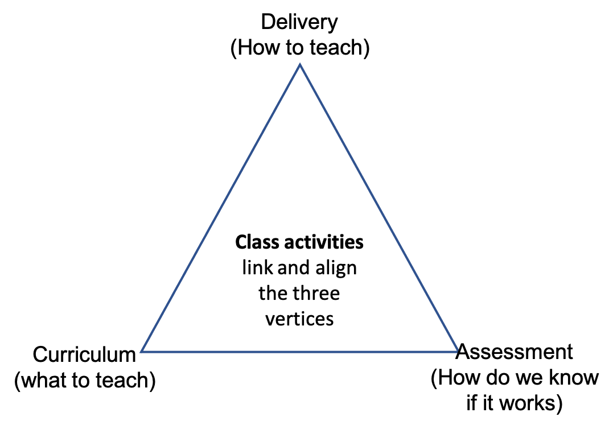
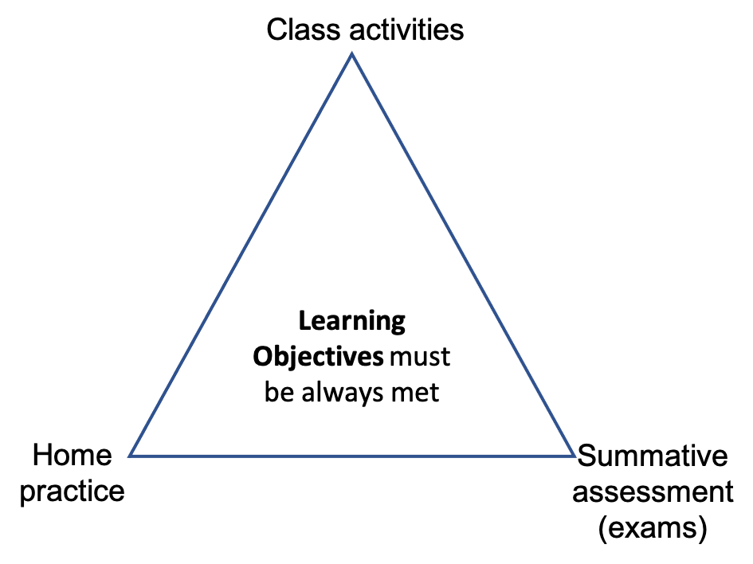
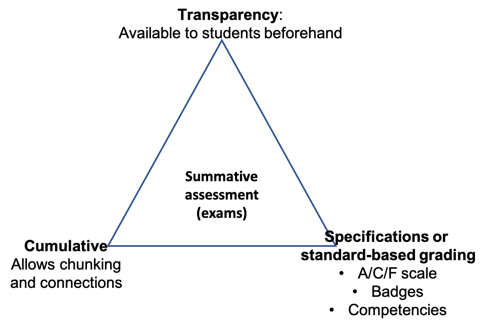
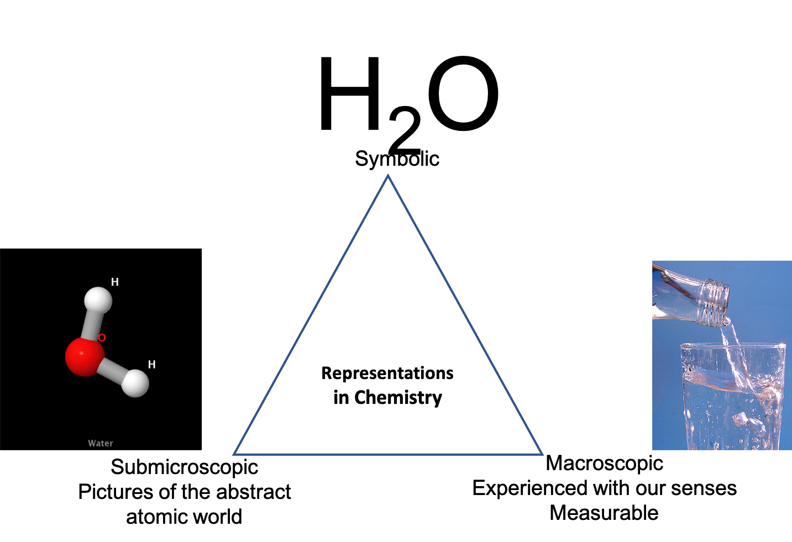
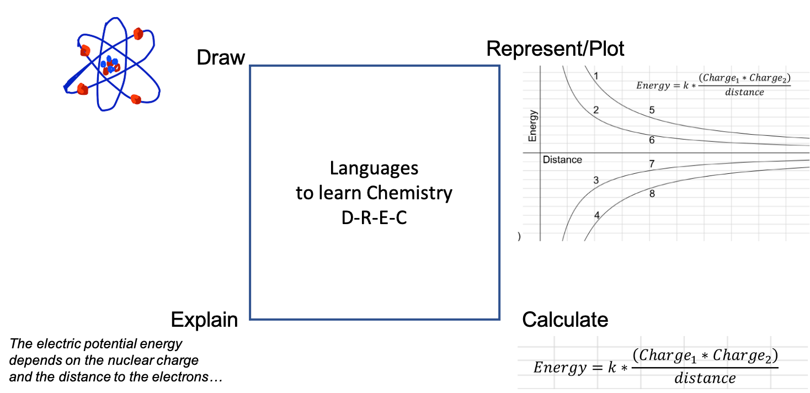
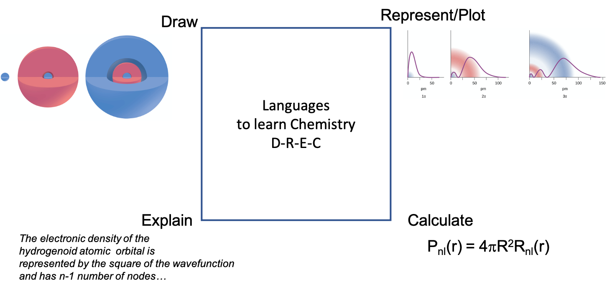

```{r setup, include=FALSE}
knitr::opts_chunk$set(echo = FALSE)

# Learn more about creating blogs with Distill at:
# https://rstudio.github.io/distill/blog.html
```

I will use the triangle shape to represent the idea that three linked and intertwined concepts
cannot be separated from one another. In this case, in my daily life as a teacher, 
there are many instances where my job requires considering a triad of linked concepts.
I'm listing here those different triads, from the most general aspects of curriculum design to
the most specific ones of chemistry learning.

## Three ideas for curriculum design

You want to design a new course, reshape an existing one. There are so many things to be taken care.
One can spend a lot of time choosing a textbook that may be barely used, designing with careful
detail an activity in class or a lecture that students will barely be paying attention to.
Should you use a homework online system provided by the publisher? How can you make sure students
learn what they are supposed to? How can you tell them?
To me it's the class activities. I make sure that the class activities align with the preclass content
and with the assessment. They do not only define your pedagogy during class 
but also the content. You may have made a video explaining something, or a great lecture or demonstration,
but if it is not assessed in form of activity, if students do not see "what's in it for them", it will
fall flat.

<figure class="image">
  
  <figcaption></figcaption>
</figure>

## Three ideas for learning objectives

There is three main arenas where students can be asked to do something, during class, during homework,
and during the exam.
Along the same lines to what I said above, the key word is alignment. Those three arenas need to be aligned.

The most extreme case of misalignment is if an instructor decides to teach a course by lecturing 
through powerpoints, assigning homework
through an online publishing platform, and a multiple choice exam that is usually a surprise for
if not content, it is for the type of questions, their depth, and the necessary skills

<figure class="image">
  
  <figcaption></figcaption>
</figure>

## Three concepts to improve summative assessments

<figure class="image">
  
  <figcaption></figcaption>
</figure>

## Three representations in chemistry

This is an old idea I believe first expressed by [Johnstone, A.H. J. Comp. Assist. Learn. 1991, 7, 701-703](https://onlinelibrary.wiley.com/doi/abs/10.1111/j.1365-2729.1991.tb00230.x) identifying
the three levels of chemical representation: the macroscopic, the symbolic, and the submicroscopic.

The very symbol H2O, depending on the context, may represent the molecule or the macroscopic state
of matter or both. Chemists will often switch from one representation to another and the instructor
must always be aware of how hard it is for some students to make this switch.

<figure class="image">
  
  <figcaption></figcaption>
</figure>

A good exercise to practice this switch is asking students to associate a list of properties to
a macroscopic, submicroscopic or symbolic. For example: density, bond length, two hydrogen per oxygen atom,
boiling point, temperature, vibrational frequency, ionization energy...

## Four languages of chemistry (not three)

When learning chemistry one should be aware that chemists use four languages: drawing/schemes, plots/graphs, explain/words, and calculations/math expressions.
Too often the first semester of undergraduate chemistry pays a lot of focus to the least intuitive 
(for most students) language of chemistry, the calculations.

Knowing chemistry implies that you can express the same idea in its four languages, but that doesn't
mean that you should expect students to use the four of them at the same time. My experience tells me
that from the most intuitive to the least (for most students) is 
drawing, representing, explaining, and calculating. So one should start with drawing.

Starting with an intuitive language such as drawing and representing will help students make the necessary
connections and lower their cognitive load once you move to a more abstract and less intuitive concepts
and languages.

Here's two examples of how atoms may be understood using the four different languages.
The first model represents an essentially coulombic or classical atom and the second one comes from
the quantum solution of the hydrogen atom.

<figure class="image">
  
  <figcaption></figcaption>
</figure>

<figure class="image">
  
  <figcaption></figcaption>
</figure>